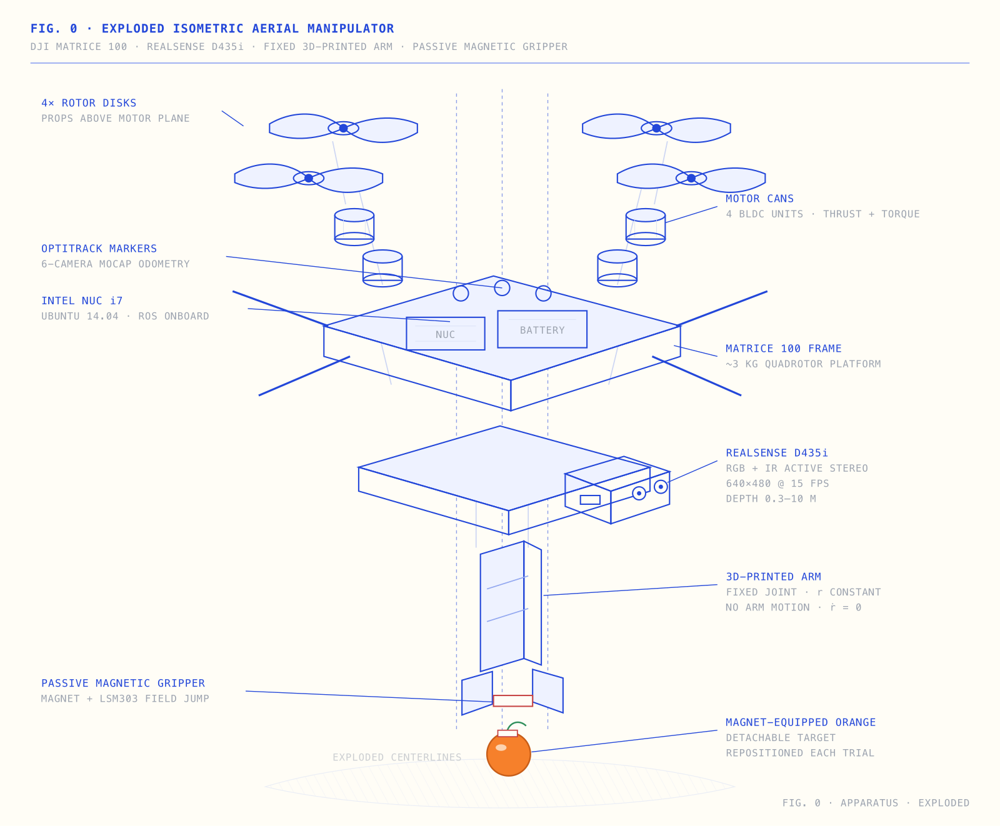
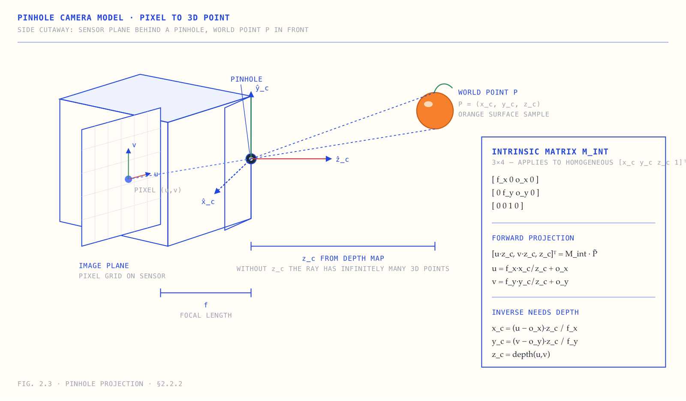
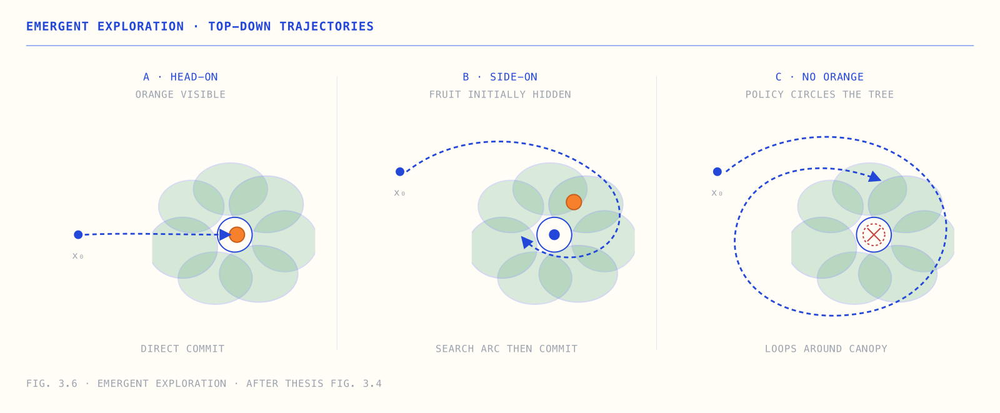

# A Visual Reading of *Perception Based UAV Path Planning for Fruit Harvesting*

A four-chapter visual reader for Siddharth Kothiyal's 2021 M.S.E. thesis at Johns Hopkins University, advised by Prof. Marin Kobilarov. The thesis presents two architectures for an autonomous fruit-harvesting drone: a classical perception-and-control pipeline, and a single neural network trained to imitate a model-predictive-control expert. This site redraws the geometry, the network architecture, and the experimental results so the material can be absorbed in roughly thirty minutes without working through the original 67-page document.

**Live site:** https://perception-uav-thesis-visual.vercel.app/

## Visual design

The visual design — cream paper background, deep technical-blue ink, monospace uppercase labels, hand-drawn semi-realistic SVG diagrams, marginalia, and the broader compositional vocabulary — is adopted from Dan Hollick's [**makingsoftware.com**](https://www.makingsoftware.com/). The design system used here is a direct application of his work to a different subject. The choice of subject and the technical content are the only original contributions in this repository.

## Previews

### Aerial manipulator (cover)

An exploded isometric of the apparatus: DJI Matrice 100 with a fixed 3D-printed arm, Intel RealSense D435i, Intel NUC, and a passive magnetic gripper.



### Pinhole projection

The geometry that maps segmented orange pixels into a 3D point in the camera frame. This is the bridge between Chapter 2's perception module and its planning module.



### Emergent exploration (Chapter 3)

When the imitation-learning policy from Chapter 3 is evaluated in a scene with no orange present — a configuration absent from the training distribution — the policy spontaneously circles the tree, exhibiting search behaviour that the loss function never encoded.



## Contents

| Page | Description |
|---|---|
| [Cover](https://perception-uav-thesis-visual.vercel.app/) | Exploded isometric view of the apparatus |
| [Chapter 1 — The problem](https://perception-uav-thesis-visual.vercel.app/chapter-1.html) | Task setup, state vector, and the two architectures the thesis compares |
| [Chapter 2 — Decoupled pipeline](https://perception-uav-thesis-visual.vercel.app/chapter-2.html) | U-Net segmentation, pinhole projection, RANSAC plane fitting, the two-step pick maneuver, and the 102-run experimental results |
| [Chapter 3 — Learning to plan](https://perception-uav-thesis-visual.vercel.app/chapter-3.html) | ResNet8 imitator, 1800-bin classification head, MPC teacher, DAgger, and emergent exploration |
| [Chapter 4 — What worked](https://perception-uav-thesis-visual.vercel.app/chapter-4.html) | Head-to-head comparison of the two architectures and discussion of trade-offs |
| [Terminology](https://perception-uav-thesis-visual.vercel.app/terminology.html) | Categorised glossary covering UAV, SE(3), RANSAC, U-Net, MPC, DDP, DAgger, Sim2Real, and related terms |

## Local development

```bash
git clone https://github.com/0xadvait/perception-uav-thesis-visual.git
cd perception-uav-thesis-visual
python3 -m http.server 8000
# open http://localhost:8000/
```

The site has no build step. It consists of approximately 4,000 lines of hand-written HTML, CSS, and inline SVG (around 250 KB on disk), with no JavaScript dependencies.

## Stack

- HTML, CSS, and inline SVG
- No JavaScript or external frameworks
- Mobile responsive (diagrams switch to horizontal-scroll panes below a 720px viewport)
- Deployed on Vercel with auto-deploy from `main`

Diagrams were drafted manually and subsequently refined with [Codex](https://github.com/openai/codex) for accuracy against the source thesis and for label hygiene at multiple viewport widths.

## Contributing

Issues and pull requests are welcome. Areas of particular interest:

- **Factual corrections.** Discrepancies between this site and the source thesis.
- **Diagram improvements.** Cleaner renders, better composition, or additional figures.
- **Translations.** The site is currently English-only.
- **Adaptations.** New visual readings of related papers built with this design system.

## Source

Kothiyal, S. (2021). *Perception Based UAV Path Planning for Fruit Harvesting.* M.S.E. Thesis, Johns Hopkins University. Advised by Prof. Marin Kobilarov.

The thesis is the authoritative source for every fact, equation, and result on this site. Modern commentary and cross-references — particularly the callouts comparing concepts to LLM-side analogues — are demarcated as editorial additions.

Author profile: [Siddharth Kothiyal](https://www.linkedin.com/in/siddharth-kothiyal/).

## License

The illustrations, prose, HTML, and CSS in this repository are released under the [MIT License](LICENSE). The underlying technical content — equations, experimental results, architectural decisions — is the work of Siddharth Kothiyal as published in his 2021 thesis, and is reproduced here under fair-use principles for educational commentary.

The visual design system is adopted from Dan Hollick's [makingsoftware.com](https://www.makingsoftware.com/).

## Acknowledgements

- [**Dan Hollick**](https://x.com/DanHollick) ([makingsoftware.com](https://www.makingsoftware.com/)) — for the visual design vocabulary that this site applies.
- **Siddharth Kothiyal** — for the source thesis.
- [**Prof. Marin Kobilarov**](https://lcsr.jhu.edu/people/marin-kobilarov/) — the thesis's primary advisor and co-author of much of its underlying control-theory literature.

## Related

A second visual reading is in development covering RT-2, OpenVLA, Diffusion Policy, and π0 — the lineage from the Kothiyal thesis to contemporary foundation-model policies for robotics.

---

Maintained by [@0xadvait](https://github.com/0xadvait) ([X](https://x.com/advait_jayant)).
